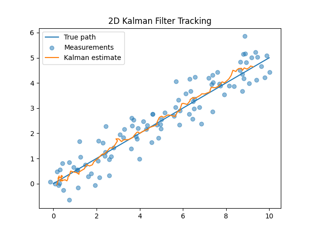
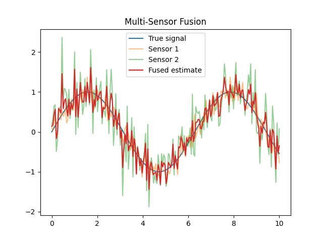
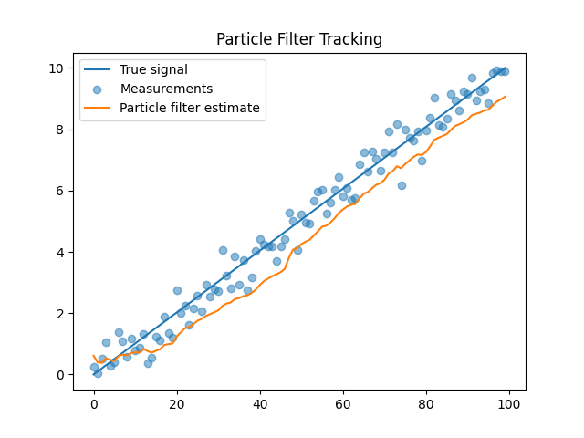

English | [Español](README.es.md)

# Bayesian Sensor Fusion

Minimal experiments illustrating Bayesian sensor fusion and probabilistic state estimation in robotics systems.

This repository explores simple probabilistic approaches for combining multiple noisy measurements to estimate hidden system states.

The examples demonstrate how Bayesian filtering techniques such as Kalman filters and particle filters can improve state estimation when sensors are uncertain or noisy.

## Contents

The `src/` directory contains three minimal experiments:

* `kalman_filter_2d.py`

  Implements a simple two-dimensional Kalman filter for tracking a moving object.

* `multi_sensor_fusion.py`

  Demonstrates how multiple noisy sensors can be fused to estimate a latent signal.

* `particle_filter_demo.py`

  Implements a basic particle filter for tracking a moving target under uncertainty.

## Purpose

These experiments illustrate engineering concepts relevant to:

* probabilistic robotics
* Bayesian state estimation
* multi-sensor fusion
* uncertainty modelling

## Motivation

Robotics and cyber-physical systems must operate with incomplete and noisy sensor data.

Bayesian estimation techniques provide a principled framework for combining uncertain measurements and estimating the underlying state of a system.

These methods are widely used in robotics, autonomous vehicles, and embedded perception systems.

## Method

The repository implements simplified Bayesian filtering techniques for state estimation.

The experiments include:

* Kalman filtering for linear Gaussian systems
* fusion of multiple noisy sensor measurements
* particle filtering for non-linear state estimation

These examples are intentionally minimal and focus on illustrating the conceptual behaviour of Bayesian filtering methods rather than full production implementations.

## Running the examples

Clone the repository and run any of the scripts:

```bash
git clone https://github.com/Jorge-de-la-Flor/bayesian-sensor-fusion
cd bayesian-sensor-fusion
python src/kalman_filter_2d.py
```

Each script generates simulated sensor measurements and visualises the resulting state estimation process.

## Example output





## Project tree

```bash
bayesian-sensor-fusion
├─ .python-version
├─ LICENSE
├─ README.es.md
├─ README.md
├─ assets
│  ├─ kalman_2d_tracking.png
│  ├─ multi_sensor_fusion.png
│  └─ particle_filter_tracking.png
├─ pyproject.toml
├─ src
│  ├─ kalman_filter_2d.py
│  ├─ multi_sensor_fusion.py
│  └─ particle_filter_demo.py
└─ uv.lock
```

## Requirements

The examples use:

* Python 3.12+
* NumPy
* Matplotlib

## Installation

Install the required dependencies:

* using `pip`

```bash
pip install numpy matplotlib
```

* using `uv`

```bash
uv add numpy matplotlib
```

## References

* Thrun, S., Burgard, W., & Fox, D. (2005).
  *Probabilistic Robotics.*

* Doucet, A., De Freitas, N., & Gordon, N. (2001).
  *Sequential Monte Carlo Methods in Practice.*
